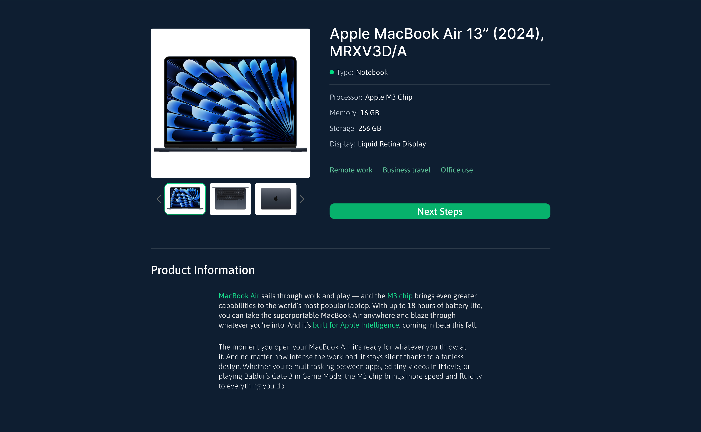
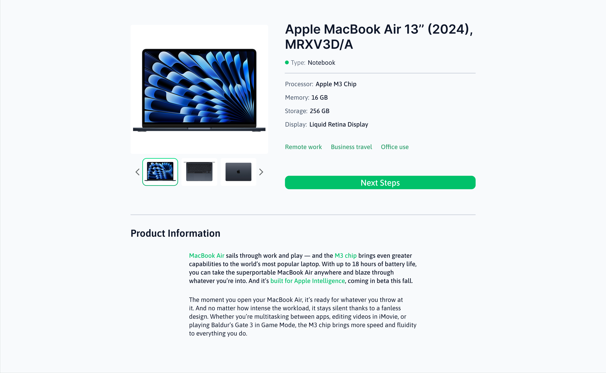
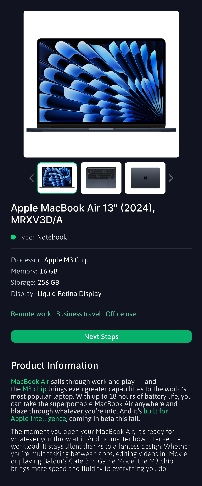
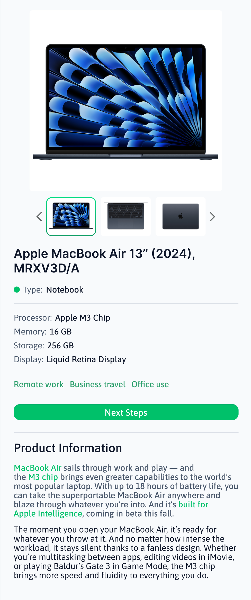

# Einleitung

Die **Detailseite** zeigt die ausführlichen Informationen zu einem Suchergebnis.

Es ist zu beachten, dass das Design mit Figma erstellt wurde und die hier genutzten Farben im finalen, implementierten Produkt dynamisch geändert werden können.

## Allgemeines Design

Die **Detailseite** zeigt die ausführlichen Informationen zu einem Suchergebnis. Sie bietet eine **große Produktdarstellung**, eine **Thumbnail-Galerie**, **technische Spezifikationen** und eine **Beschreibung**. Die Seite ist für **Darkmode & Lightmode** sowie für **Mobile & Desktop** optimiert.

### Desktop-Version

### Struktur der Detailseite

1. **Produktbild**

   - Großes, zentrales Bild zur visuellen Hervorhebung.
   - Bildnavigation mit **Thumbnails** für verschiedene Ansichten.

2. **Bildergalerie (Thumbnail-Navigation)**

   - Kleine Vorschau-Bilder unter dem Hauptbild.
   - **Pfeile links und rechts** zum Durchblättern.
   - Das aktive Bild hat **einen grünen Rahmen**.

3. **Produktinformationen**

   - **Produktname**: Groß, fett gedruckt.
   - **Produkttyp**: Mit **grünem Punkt** als Indikator.
   - **Technische Spezifikationen**:
     - Labels in **hellgrau**, Werte in **fetter Schrift**.

4. **Tags für Verwendungszweck**

   - **Beispiele:** `Remote Work`, `Business Travel`, `Office Use`
   - Farbige Labels zur schnellen Orientierung.

5. **Interaktionsbutton ("Next Steps")**

   - Großer **grüner Button** für weiterführende Aktionen.
   - Auffällig platziert für bessere Usability.

6. **Produktbeschreibung**
   - Überschrift **"Product Information"** in fetter Schrift.
   - Strukturierte Absätze mit Kernfeatures.
   - ichtige Begriffe sind grün markiert.

---

## Design-Details nach Modus

### **Darkmode**

- **Hintergrund**: Sehr dunkles Blau für hohen Kontrast.
- **Textfarben**:
  - Weiß für Produkttitel.
  - Hellgrau für Labels (Speicher, RAM, etc.).
  - Fettgedrucktes Weiß für Werte.
  - Grüner Akzent für wichtige Begriffe in der Beschreibung.
- **Bildergalerie**:
  - Aktives Bild hat einen grünen Rahmen.
  - Thumbnails mit weißem Hintergrund für bessere Sichtbarkeit.
- **Tags**:
  - Grüne, blaue und graue Labels mit weißer Schrift.
- **Button "Next Steps"**:
  - Grün mit weißer Schrift.
  - Leichter Schatteneffekt für bessere Erkennbarkeit.

### **Lightmode**

- **Hintergrund**: Sehr helles Grau/Weiß für ein sauberes Design.
- **Textfarben**:
  - Dunkelgrau für Produkttitel.
  - Hellgrau für Labels.
  - Dunkel für Werte.
  - Grüner Akzent für hervorgehobene Begriffe.
- **Bildergalerie**:
  - Aktives Bild mit grünem Rahmen.
  - Thumbnails mit leichtem Schatten für bessere Abhebung.
- **Tags**:
  - Farbschema bleibt wie im Darkmode.
- **Button "Next Steps"**:
  - Grün mit dunkler Schrift.

---

## Unterschiede zwischen Desktop und Mobile

| Merkmal                     | Mobile                    | Desktop                       |
| --------------------------- | ------------------------- | ----------------------------- |
| **Anordnung**               | Linear gestapelt          | Mehrspaltiges Layout          |
| **Bildgröße**               | Großes Bild mit Scrolling | Hauptbild links, Infos rechts |
| **Bildergalerie**           | Horizontal scrollbar      | Direkt sichtbar               |
| **Platzierung des Buttons** | Unterhalb der Tags        | Neben und unter den Infos     |

| Mobile Darkmode                                                                                   | Mobile Lightmode                                                                                    |
| ------------------------------------------------------------------------------------------------- | --------------------------------------------------------------------------------------------------- |
|  |  |
